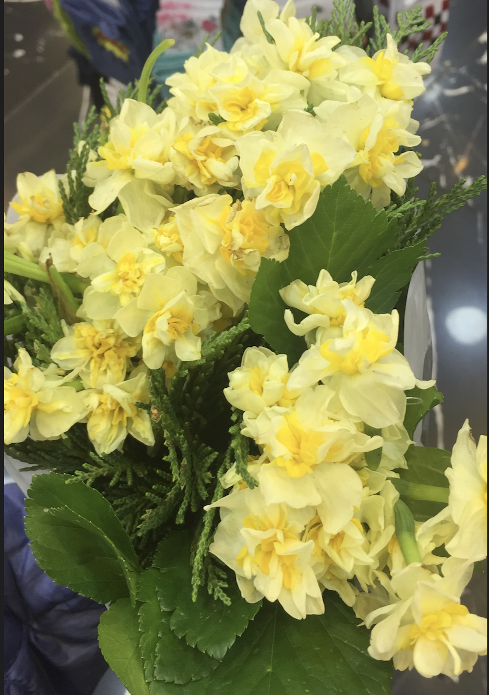

# image_convolution

This is a simple implemention of 2D image convolution. 

## Technologies

- Python 3.8.5
- Packages Used: numpy, PIL

## Features

- Multiple filters can be applied at the same time. 
- Both 3 and 1 channeled images are supported. 
- Stride values other than 1 are supported. 
- Only square kernels are supported.
- User is given the option to pick between a colored or gray output. 
- Stride and image information is received from the user using console input. 
- Similarly, the output file name is decided by the user and saved with a jpg extension.
- Kernels should be entered in a specific format to the filter.txt file.

### How to format kernels in the filters.txt file? 

Every line in the filters.txt file corresponds to one kernel/filter. At the beginning of each line, there should be a string indicating the name of the filter. Then, the numbers that make up the kernel should be entered from top to bottom, left to right with spaces between them. A 3 by 3, horizontal kernel would look as follows:

horizontal3by3 1 0 -1 1 0 -1 1 0 -1

## Usage 

Program can be used by running the convolution.py file. The image on which the convolutions will be performed on and the filters.txt file should be in the same directory. The output will also be saved into the same directory. 

## Illustrations

Here is an example of a 2D convolution using a 3 by 3 horizontal kernel with a stride of 1:

Below are other examples of 2D convolution again using a 3 by 3 horizontal kernel with a stride of 1 and 3:

## Status of the Project

This project is completed. No further changes are expected in the near future. 

## Inspiration 

This project is an extension of one of the assignments I have completed for the Neural Networks course at Harvey Mudd College, taught by Elizabeth Sweedyk.

## Testing

Some of the tests that were used to evaluate convolution.py can be found in the test_suite.py file. 

